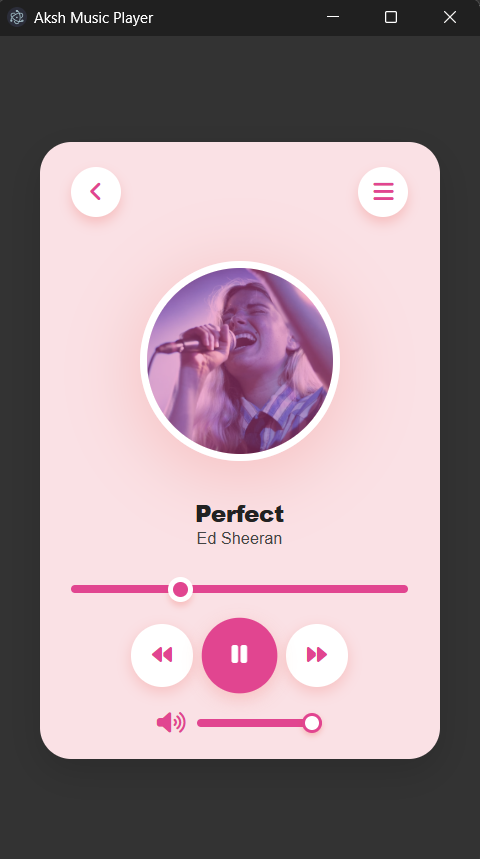
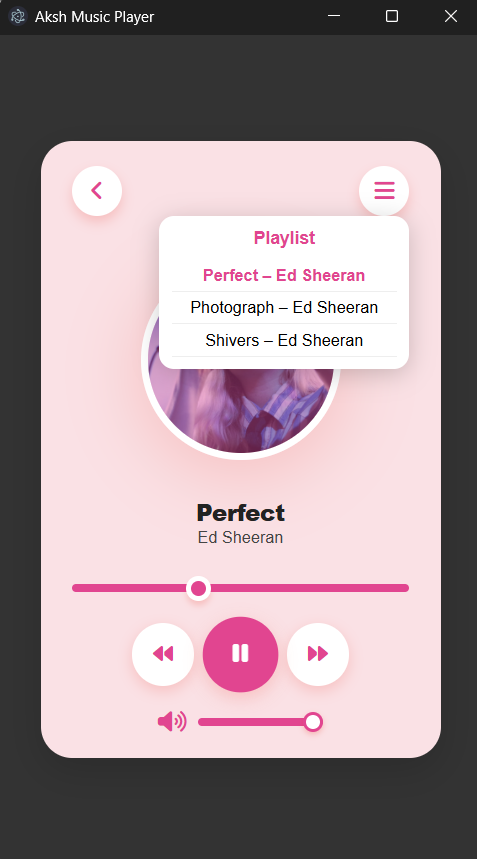

# 🎧 Electron Music Player

A custom desktop music player built using **HTML**, **CSS**, **JavaScript**, and **Electron**.

## 🚀 Features

- 🎵 Play/pause local audio files
- 🎚 Stylish UI
- ⚡ Built as a cross-platform desktop app using Electron
- 🖥 Works offline – no internet required

## 📸 Screenshots

> Screenshots of the app UI

### 🖼 Now Playing Screen

### 🖼 Playlist Screen

## 🛠 Tech Stack

- **Frontend:** HTML, CSS, JavaScript
- **Backend:** Node.js (Electron)
- **Build Tool:** Electron Forge / Electron Packager

